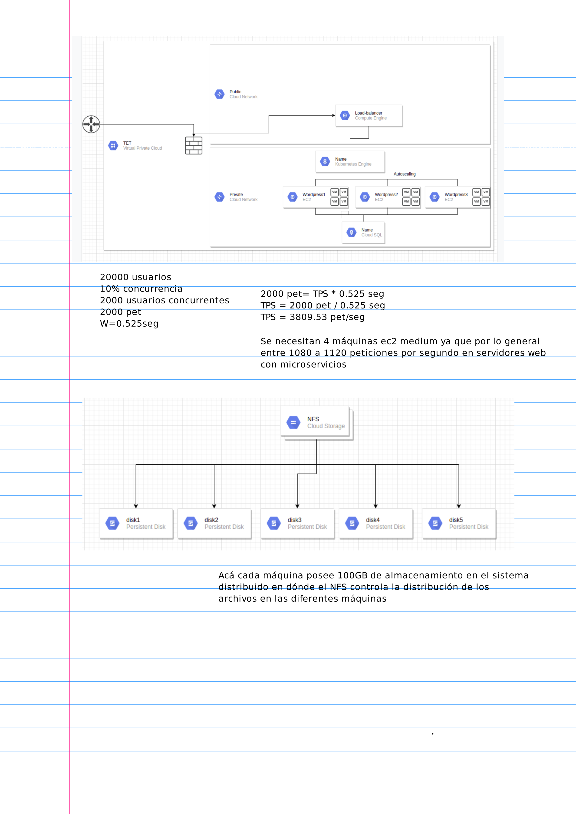
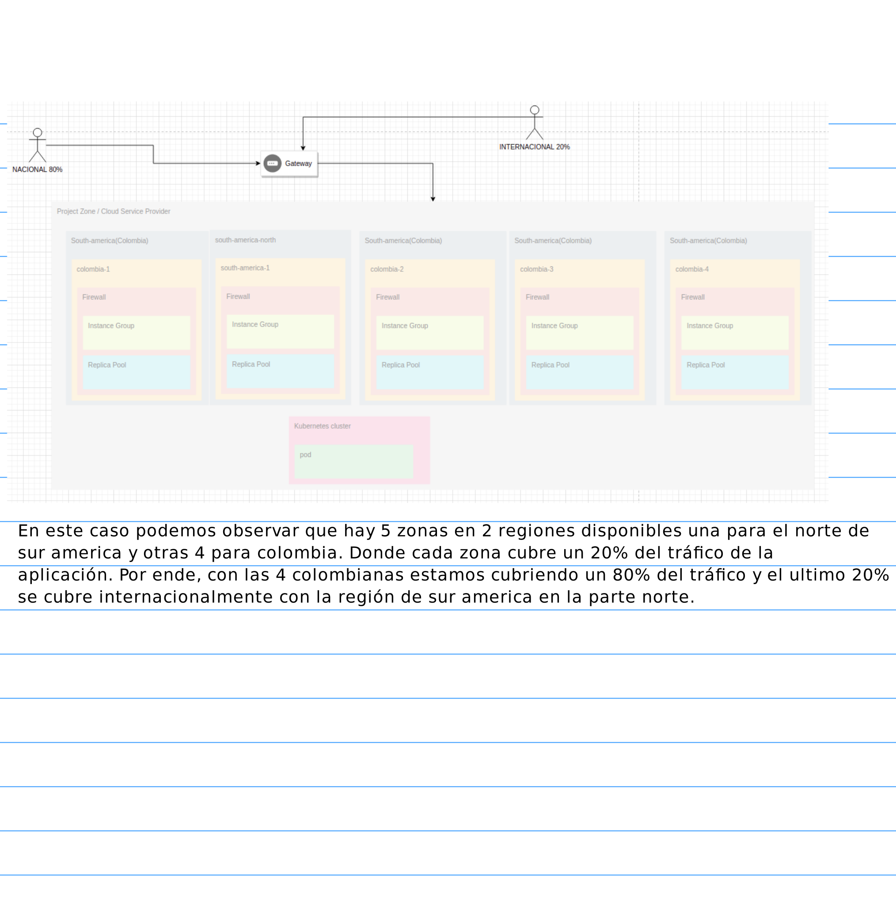

# Deployment-tet-2
This is a project for networking 2 course 
## Requirements
### Functional Requirements 

• El sistema debe listar los proyectos de cada curso para acceder fácilmente a ellos
    
• El sistema debe abrir los detalles de cada curso para ver en específico sobre qué trata cada proyecto y quiénes los hacen
    
• El sistema debe dividir los proyectos según el curso para diferenciarlos fácilmente
    
• El sistema debe mostrar quienes hicieron el proyecto, profesor, y un resumen con su respectiva imagen y fecha de publicación
    
• El sistema debe separar por semestres los proyectos publicados

###  Non-Functional Requirements:

• Todas las comunicaciones entre servicios deben estar cifradas (SSL).

• La respuesta de la página debe ser menor a 2 segundos

• Debe estar disponible mínimo disponible 23 horas, 6 o 7 días a la semana 

• El acceso a la información debe ser fácil

• El producto debe ser usable e intuitivo 

• El producto debe ser establece cuando hay muchas personas observando los diferentes proyectos.

## This is the design level

## This is the design and implementation level
