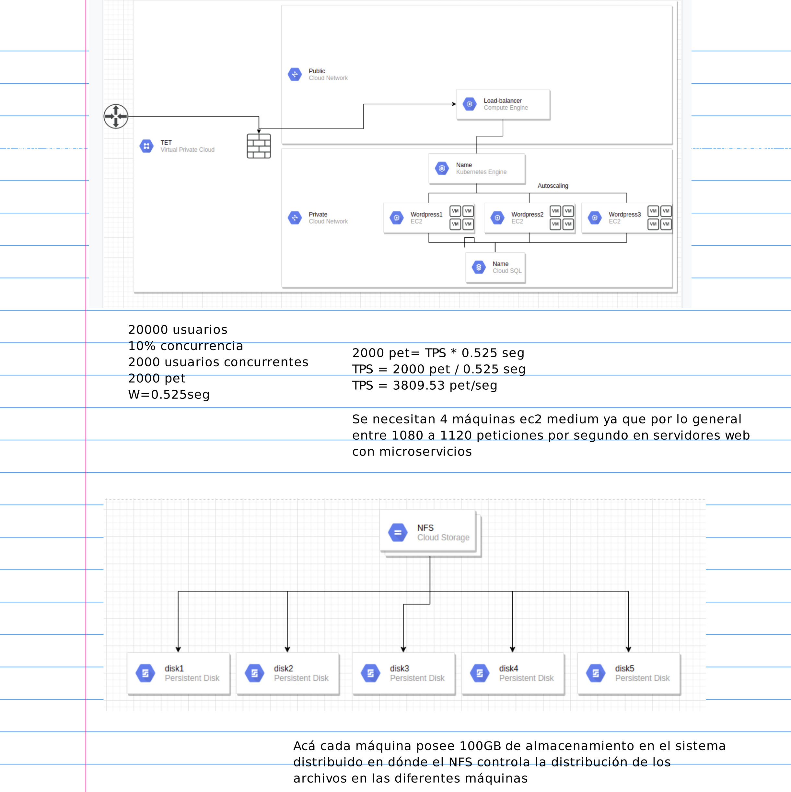

# Deployment-tet-2
This is a project for networking 2 course by Armando Ríos Gallego and Julian Rios Vasquez
## Requirements
### Functional Requirements 

• El sistema debe listar los proyectos de cada curso para acceder fácilmente a ellos.
    
• El sistema debe abrir los detalles de cada curso para ver en específico sobre qué trata cada proyecto y quiénes los hacen.
    
• El sistema debe dividir los proyectos según el curso para diferenciarlos fácilmente.

###  Non-Functional Requirements:

• Todas las comunicaciones entre servicios deben estar cifradas (SSL).

• La respuesta de la página debe ser menor a 2 segundos.

• Debe estar disponible. 

• El acceso a la información debe ser fácil.

• El producto debe ser usable e intuitivo.

• El producto debe ser establece cuando hay muchas personas observando los diferentes proyectos.
## App Monolitica 
```
version: '3'

services:
  db:
    image: mysql:8.0
    container_name: db
    restart: unless-stopped
    env_file: .env
    environment:
      - MYSQL_DATABASE=wordpress
    volumes:
      - dbdata:/var/lib/mysql
    command: '--default-authentication-plugin=mysql_native_password'
    networks:
      - app-network

  wordpress:
    depends_on:
      - db
    links:
      - db
    image: wordpress:5.1.1-fpm-alpine
    container_name: wordpress
    restart: unless-stopped
    env_file: .env
    environment:
      - WORDPRESS_DB_HOST=db:3306
      - WORDPRESS_DB_USER=$MYSQL_USER
      - WORDPRESS_DB_PASSWORD=$MYSQL_PASSWORD
      - WORDPRESS_DB_NAME=wordpress
    volumes:
      - wordpress:/var/www/html
    networks:
      - app-network

  webserver:
    depends_on:
      - wordpress
    image: nginx
    container_name: webserver
    restart: always
    ports:
      - "80:80"
      - "443:443"
    volumes:
      - wordpress:/var/www/html
#      - ./cert/nginx:/etc/nginx/conf.d
      - ./nginx:/etc/nginx/conf.d
      - certbot-etc:/etc/letsencrypt
      - ./nginx/logs:/var/log/nginx
    networks:
      - app-network

  certbot:
    depends_on:
      - webserver
    image: certbot/certbot
    container_name: certbot
    volumes:
      - certbot-etc:/etc/letsencrypt
      - wordpress:/var/www/html
    command: certonly --webroot --webroot-path=/var/www/html --email $EMAIL_DOMAIN --agree-tos --no-eff-email -d $MAIN_DOMAIN
#    command: delete --cert-name $MAIN.DOMAIN

volumes:
  certbot-etc:
  wordpress:
  dbdata:

networks:
  app-network:
    driver: bridge
```
With this docker-compose.yml, we have to run first the docker-compose up with the line "- ./nginx:/etc/nginx/conf.d" commented. Later, down the services with docker-compose down and run again the docker-compose up but with the line "- ./cert/nginx:/etc/nginx/conf.d" commented.

[Link of the app monolitic](https://ariosg-test.xyz)

## This is the design level


## This is de pricing of this project monthly

